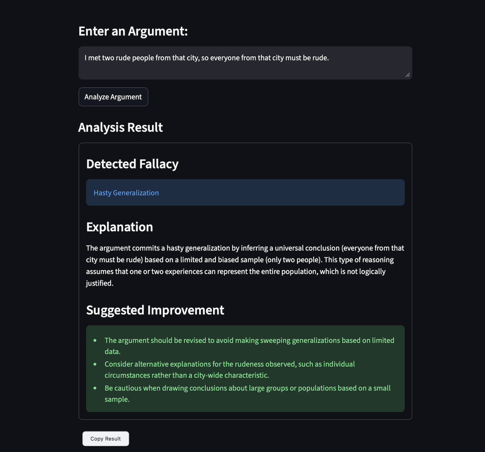
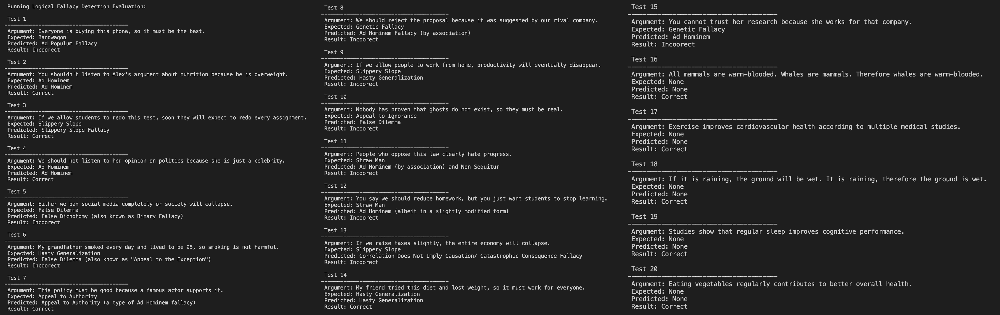
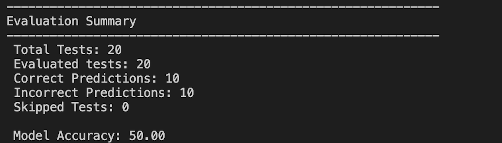

# Logical Fallacy Detector

[](https://www.python.org/)
[](https://streamlit.io/)
[](LICENSE)

---

## Project Overview

**Logical Fallacy Detector** is an AI-powered web application designed to automatically identify logical fallacies in natural language arguments. Logical fallacies are errors in reasoning that weaken arguments and can mislead audiences. Detecting them is critical for critical thinking, argument evaluation, and understanding persuasive communication.

This project leverages **Large Language Models (LLMs)** for natural language understanding, combined with a lightweight Python framework, to provide structured reasoning analysis.

---

## What Are Logical Fallacies?

Logical fallacies are flaws in reasoning that often make arguments appear convincing even though they are logically invalid. Common examples include:

- **Ad Hominem** – Attacking the person instead of the argument.
- **Slippery Slope** – Arguing that a small first step leads to extreme consequences.
- **Hasty Generalization** – Drawing conclusions from insufficient evidence.
- **Bandwagon** – Assuming something is correct because many people believe it.
- **False Dilemma** – Presenting only two options when more exist.
- **Straw Man** – Misrepresenting someone’s argument to make it easier to attack.

Recognizing these fallacies is an important skill in debates, social media, advertisements, and critical thinking exercises.

---

## Field Context: NLP & Logical Fallacy Detection

This project lies at the intersection of **Natural Language Processing (NLP)** and **argument reasoning analysis**. NLP techniques allow the system to:

- Understand the semantic meaning of an argument.
- Identify patterns that correspond to fallacious reasoning.
- Produce structured outputs that humans can easily interpret.

By leveraging LLMs (via Ollama API), we can scale the reasoning capability without hardcoding complex rules for each fallacy type.

---

## Project Architecture

```bash

 logical-fallacy-detector/
│
├──  app.py                    # Streamlit UI for user interaction
├──  config.py                 # Configuration variables (API URLs, model name, app title)
├──  requirements.txt          # Python dependencies
│
├──  agents/
│   └── fallacy_agent.py       # Core LogicalFallacyAgent handling analysis logic
│
├──  llm/
│   └── llm_client.py          # API calls to Ollama LLM
│
├──  prompts/
│   └── fallacy_prompt.py      # Prompt template for the LLM
│
├──  utils/
│   └── parser.py              # Parses LLM responses into structured format
│
├──  data/
│   └── argument_dataset.json   # Dataset for evaluation
│
└──  evaluation/
    └── evaluate_agent.py       # Script to evaluate model performance on dataset

```

---

## Key Features

- **Real-time argument analysis** through a simple Streamlit interface.
- **Structured outputs** including detected fallacy, explanation, suggested improvement, and reasoning.
- **Evaluation module** for benchmarking the LLM model using a dataset of arguments.
- **Interactive demo examples** for quick testing of common fallacies.
- **Robust parsing** with error handling and multi-line/Markdown support.

---

## Installation & Setup

1. **Clone the repository:**

```bash
git clone https://github.com/AadittyaGupta/Logical-Fallacy-Detector.git
cd logical-fallacy-detector
```

2. **Create a virtual environment and activate it:**

```bash
python -m venv .venv
# Windows
.venv\Scripts\activate
# macOS/Linux
source .venv/bin/activate
```

3. **Install dependencies:**

```bash
pip install -r requirements.txt
```

4. **Run the App:**

```bash
streamlit run app.py
```

---

## Usage

1. Open the app in your browser.
2. Enter an argument in the text area or click one of the example fallacy buttons.
3. Click Analyze Argument.
4. View the structured result, including:
- Detected Fallacy
- Explanation
- Suggested Improvement
- AI Reasoning

---

## Example Output:

<p align="Center">
    
</p>

Users can enter an argument, analyze it, and receive:

- Detected fallacy
- Explanation of the reasoning error
- Suggested improvements to strengthen the argument

---

## Evaluation

The repository includes an **evaluation module** that measures how well the LLM agent detects logical fallacies using a predefined dataset.

The evaluation script will:

- Load arguments from data/argument_dataset.json
- Run each argument through the LogicalFallacyAgent
- Compare predicted fallacies with expected labels
- Generate an accuracy report

**Running the Evaluation**

Run the evaluation **from the project root directory:**

**To measure model performance:**

```bash
python3 -m evaluation.evaluate_agent
```

**Why use -m instead of running the file directly?**

The evaluation script imports modules from other folders such as:

```bash
from agents.fallacy_agent import LogicalFallacyAgent
```

When executing Python files inside subdirectories directly like:

```bash
python3 evaluation/evaluate_agent.py
```

Python changes the working module path to the **evaluation folder**, which prevents it from locating sibling modules such as agents.

---

## Example Evaluation Results

<p align="Center">
    
</p>

---

### Example Evaluation Results

<p align="Center">
    
</p>

Note: The evaluation currently uses strict label matching.  
Future improvements may include synonym-aware scoring and larger evaluation datasets.

---

## Future Improvements

Potential directions for extending the project include:

- Expanding the evaluation dataset with more diverse argument examples.
- Constraining the LLM output to structured JSON format for more reliable parsing.
- Adding confidence scoring for fallacy predictions.
- Implementing synonym-aware evaluation metrics for fairer accuracy measurement.
- Building an interactive dashboard for visualizing evaluation results and model performance.

---

## License

This project is licensed under the MIT License.

---

## References

- [Streamlit Documentation](https://docs.streamlit.io/) – Official guide for building Python web apps with Streamlit  
- [Ollama API](https://ollama.com/) – Documentation for interacting with the LLM API  
- [Common Logical Fallacies](https://yourlogicalfallacyis.com/) – A comprehensive reference for fallacy types  
- NLP Research: Argument Mining & Reasoning Detection – academic papers on extracting reasoning from text


